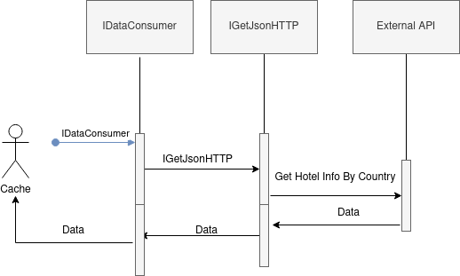
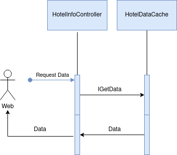

# README 

# Overview

The main matter of this project is to create a software, as simple as possible, capable of showing in a web browser information about scored hotels by country just running a script. The information should be:
 
1. 3 top-scored Hotels by country.
2. Average hotel score by country.

# Technic Requeriments

- The main page has to be separated from the data API and consume its information throw an HTTPS Get request.
 
- The data API has to consume the information from an external test API, operate over that information and save just the useful data to serve it to the main page using a controller.
 
- The external test API used to fail, but it is going to serve the right data by an HTTPS Get request. 

- Adaptable design in the front end available for each kind of dispositive.

# How do I get set up?

A quite simple script is available to run the app. Its name is **runapp.sh** and it is situated inside the scripts folder. To make that script run, some technical requirements are needed.
 
1. .Net Core 3.1, Asp.Net and SDK installed. https://docs.microsoft.com/es-es/dotnet/core/install
2. Python 2 installed. https://www.python.org/downloads/
3. Bash shell.
 
It is very quick, just run "bash runapp.sh" on a bash shell inside the folder. The default web browser will be opened after 30 seconds. No sudo command is needed but your administrator password will be required on the console.
 
It is exists the possibility to run a script which is going to install every single dependency automatically before to launch the app but that script **has been coded just for work on Ubuntu 20.\* operating system**. If you choose to execute that one just open a bash shell, navigate until the scripts folder of the project and run "bash runinstallingdependencies.sh".
 
**Notes:**
**Testing the script in several machines I have found sometimes the webpage does not work fine for Firefox browsers. This is produced for a security CORS conflict with this browser in somes machines. If Firefox is your default webbrowser and the page does not work for you please, copy the path to the file from the url bar and paste it on a Chromium based browser.**
The app is going to be launched on http//:localhost:5000 and https//:localhost:5001 ports so if some process is using them the launch will fail so please be sure they are available.

# Contribution guidelines 

* Writting design
* Defining classes
* Writing tests
* Implementing classes
* Performing tests
* Code review
* Performing tests
* Documenting app

# Who do I talk to? 

* Repository owner or admin

# Technologies

- .Net Core 3.1 
- Asp .Net 5.0
- SDK 5.0 
- Html 5
- Css
- Javascript
- Python2

# Design

## Previous Considerations

Since main points are the interfaces (what do the application) this project has been designed thinking exclusively in order to create an app available to achieve its functions as soon as possible. That implies simplifying the code and developing it taking care about performance and about the time the software needs to serve the data. Parallel programming helps to achieve short times but only when the task is long enough to assume the parallelizing cost. This cost has been translated exclusively to the back end API since if the responsable app of performing calculations is quick the front end just needs to be parallelized in order to make better the user experience. To conclude, just to mention that the main concepts of the app design are understandable only with sequence flow diagrams and to say that only the back end has been parallelized and it works, throw a cache looking for the whole information as soon as possible to some webpage.

## Secuence Flow

### DataGetting Secuence Flow

### ServedData Secuence Flow

